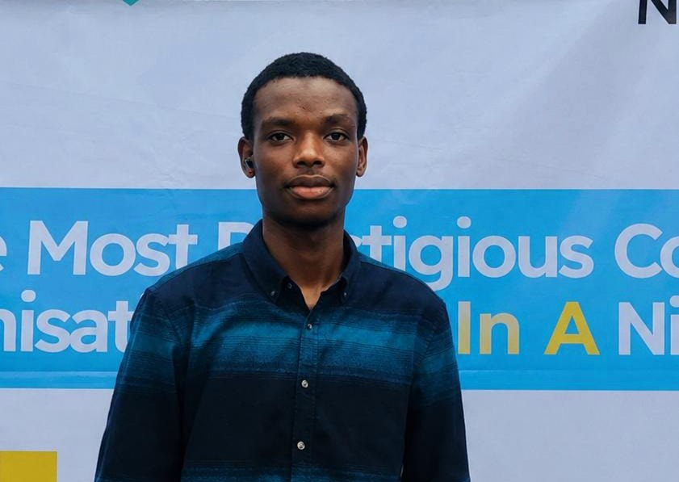

Hi there, I'm Ridwan 👋🏽

I'm a Statistics student and Data Analyst with an interest in using data to answer meaningful business questions and support better decision-making.

I enjoy analyzing data, identifying patterns, and turning findings into clear insights and visualizations. I'm currently building my analytical skills through practical projects while developing stronger skills in business thinking, data storytelling, and visualization.

## 🛠️ Tools & Skills

- **Excel** — Data Cleaning, Pivot Tables, Pivot Charts & Dashboards
- **SQL** — Data Querying & Analysis
- **Power BI** — Data Modeling, DAX & Interactive Dashboards
- **Statistics** — Statistical Analysis & Interpretation

## 📊 Featured Projects

- [**Global Sales Performance Analysis**](https://github.com/DECODED04/global-sales-performance-analysis) — Analysis of sales performance across customers, products, regions, transactions, and delivery operations.

- [**Healthcare Revenue & Utilization Analysis**](https://github.com/DECODED04/HEALTHCARE-REVENUE-UTILIZATION-) — Analysis of healthcare revenue, encounters, insurance payers, mortality, and utilization patterns.

- [**Retail Sales & Customer Performance Analysis**](https://github.com/DECODED04/retail-sales-customer-analysis) — Power BI analysis of sales, profitability, products, customer demographics, and geographic performance.

- [**Sales Performance Analysis**](https://github.com/DECODED04/sales-performance2-powerbi-analysis) — Power BI analysis of sales opportunities, products, company accounts, and sales performance.
  
## 🌱 Currently Working On

- Developing stronger analytical and critical-thinking skills
- Improving data visualization and storytelling
- Building more comprehensive, independent data analysis projects

## 👨🏽‍💼 Beyond Data

I also have an interest in leadership, volunteering, and personal development. I currently serve as the President of my departmental student association, where I'm developing practical experience in leadership, organization, and teamwork.

## 📫 Connect With Me

- LinkedIn: https://www.linkedin.com/in/ridwan-aminu-108425365?utm_source=share_via&utm_content=profile&utm_medium=member_android
  
- x: https://x.com/De_Coded_04

